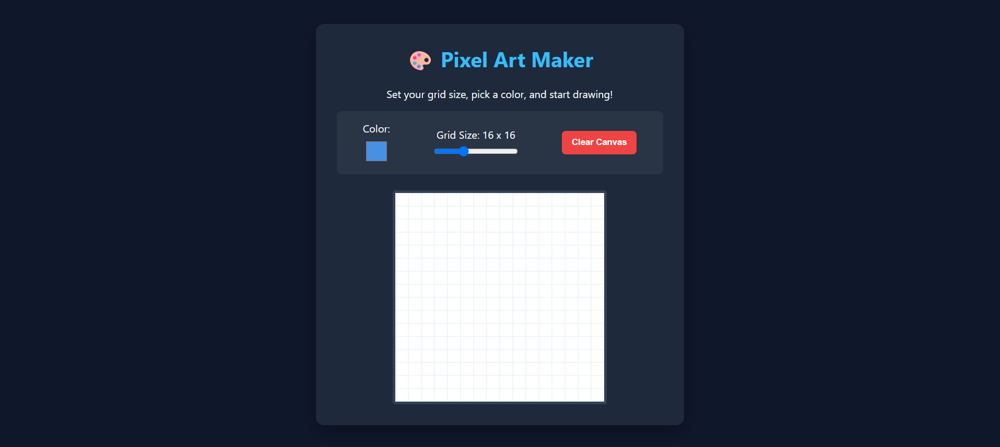

# 🎨 Modern Pixel Art Maker

A lightweight, highly responsive, and interactive digital drawing canvas built entirely using Vanilla HTML, CSS, and JavaScript. Perfect for students learning DOM manipulation and CSS Grid!

---

## 🚀 Live Demo Link

Check out the live version here:
**[👉 Live Demo](https://snehavish595.github.io/pixel-art-maker/)**

---

## 📸 Preview



**Main Features in Action:**
- Interactive color picker at the top
- Dynamic grid size slider (8x8 to 32x32)
- Beautiful dark theme interface
- Responsive canvas for drawing
- One-click clear button

---

## 📂 Folder Structure

```
pixel-art-maker/
├── index.html          # Main HTML markup and structure
├── style.css           # Custom UI styling and Dark Theme colors
├── script.js           # JavaScript logic for drawing and grid sizing
├── README.md           # Documentation and setup instructions
└── images/
    └── screenshot.png  # Preview image for GitHub
```

---

## ✨ Features

### 🎨 Dynamic Grid Sizing
Smoothly change canvas density from 8x8 up to 32x32 using a custom slider. Watch the grid regenerate in real-time!

### 🌈 Color Picker
Choose any color from the full hex spectrum. Pick your perfect shade before you start drawing.

### 🖌️ Click-and-Drag Drawing
Smooth painting experience by clicking and dragging across pixels. No lag, pure vanilla JavaScript!

### 🔄 One-Click Reset
Instantly wipe the canvas clean to start a new masterpiece. All pixels reset to white in a flash.

### 🌙 Dark Mode Aesthetic
Sleek, modern, and eye-friendly UI with a beautiful dark color scheme that's perfect for creativity.

### 📱 Responsive Design
Works seamlessly on desktop and tablet devices. The canvas and controls adapt to different screen sizes.

### ⚡ Lightweight & Fast
Pure vanilla code = No frameworks, no dependencies, no bloat. Ultra-fast performance!

---

## 🛠️ Tech Stack

- HTML5
- CSS3
- JavaScript (ES6+)
---

## 🚀 Local Setup Guide

Follow these simple steps to run this project on your local machine:

### 1️⃣ Clone or Download the Project

You can download the ZIP folder directly from GitHub, or clone it using Git:

```bash
git clone https://github.com/snehavish595/pixel-art-maker.git
```

### 2️⃣ Open the Project Folder

Navigate into the project directory:

```bash
cd pixel-art-maker
```

### 3️⃣ Run the App

Since this project uses pure, vanilla front-end code, **no installations or servers are required!**

#### **Method A (Easiest)** 🎯
Simply double-click the **index.html** file, and it will open instantly in your default web browser.

#### **Method B (For VS Code users)** 💻
1. Right-click **index.html** in VS Code
2. Select **"Open with Live Server"**
3. Automatic refresh every time you save changes

#### **Method C (Using Python)**
If you have Python installed:

```bash
# Python 3
python -m http.server 8000

# Python 2
python -m SimpleHTTPServer 8000
```

Then visit: `http://localhost:8000`

---

## 📖 How to Use

### Getting Started

1. Pick Your Color 🎨

2. Adjust Grid Size 📐

3. Start Drawing 🖌️

4. Clear Canvas 🔄

---

## 🎯 Learning Outcomes

Perfect for students to learn:

✅ **DOM Manipulation** - Creating and updating elements dynamically  
✅ **CSS Grid** - Building responsive layouts with modern CSS  
✅ **Event Handling** - Mousedown, mouseover, and mouseup events  
✅ **State Management** - Tracking drawing state with variables  
✅ **ES6 JavaScript** - Arrow functions, template literals, and modern syntax  
✅ **Responsive Design** - Making apps work on different screen sizes  

---

## ⭐ Contributing & Forking

Want to customize this project, add an eraser tool, or add a download button? Forks and stars are highly appreciated!

### How to Contribute

1. **Fork the Repository**
   - Click the **Fork** button at the top right of this page
   - This creates your own copy of the project

2. **Create Your Feature Branch**
   ```bash
   git checkout -b feature/AmazingFeature
   ```

3. **Make Your Changes**
   - Add your improvements
   - Test thoroughly in your browser
   - Keep code clean and commented

4. **Commit Your Changes**
   ```bash
   git commit -m 'Add some AmazingFeature'
   ```

5. **Push to Your Branch**
   ```bash
   git push origin feature/AmazingFeature
   ```

6. **Open a Pull Request**
   - Go to GitHub and open a Pull Request
   - Describe your changes clearly
   - Let's build something cool together!

### 🎯 Feature Ideas for Contributors

- ✨ **Eraser Tool** - Add ability to erase pixels
- 💾 **Download Feature** - Save artwork as PNG/JPG
- 🔙 **Undo/Redo** - Step back through your drawing history
- 🎨 **Color Palette** - Pre-set color palettes to choose from
- 📏 **Pixel Counter** - Show how many pixels you've colored
- 🖼️ **Gallery** - Save multiple drawings in session storage
- 📱 **Touch Support** - Better mobile/tablet drawing experience

---

## 🌟 Show Your Support

If you like this project:
- ⭐ **Star this repository** - Gives us motivation!
- 🍴 **Fork it** - Make it your own
- 💬 **Share feedback** - We love hearing from you
- 🤝 **Contribute** - Help make it better

---


